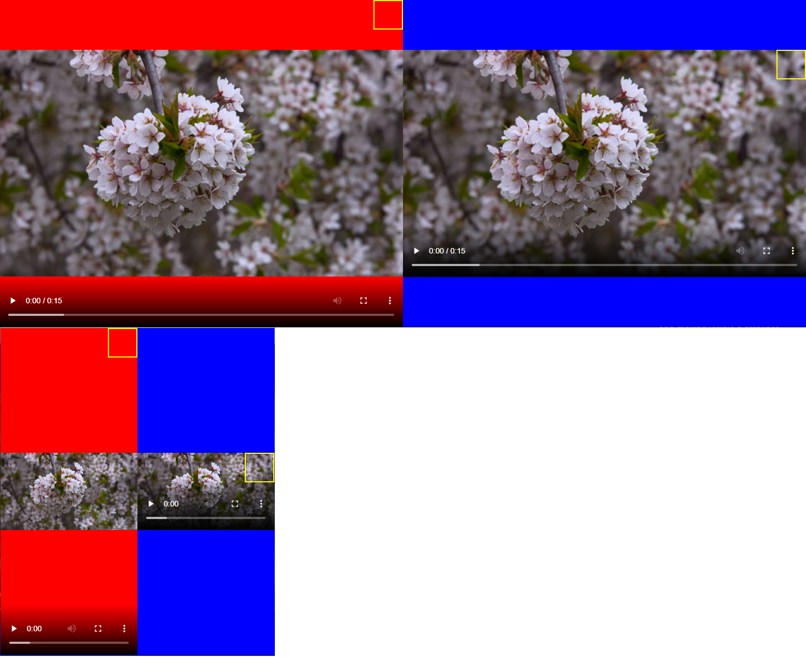
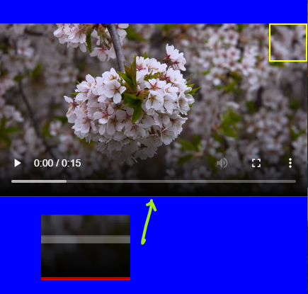

# @aspect-ratio/core

# Initial Motivation

This library supplied me a responsive aspect ratio calculation for canvas elements which are located on top of video elements.

The root cause is video elements add extra borders/areas in order to adjust the aspect ratio of the framed picture being displayed (displayed area).
Then the displayed area size is not the same as the video element's size.




# What this library does

With JS we wouldn't be able to be fully 100% responsive out of the box. 
We could use "videoHeight" & "videoWidth" in order to force some wrapper that fits with the ratio by taking into count the video element size.
But that solution means a continuous watching of the video size which could change due to other elements such as the sidebar pushed it.


With CSS we could calculate aspect ratio, but mostly CSS solutions are just taking in count the width since they are based on padding by percentage, and this is based on the width.

That could end up in an element that overflows the size of its parent and making visible a scrollbar.

*I only found a solution taking in count the `height`* but only works if the element fits width the viewport size.

By using an iframe we can apply the last solution, forcing the iframe to fit with its parent. 
The nested window will fire the resize event once the iframe's parent size changes.

So, it is fully responsive 🚀


# Installation

```
npm i @aspect-ratio/core
```

# Usage


```html

<div id="container">
	<div id="mask">
		<!-- content to force an aspect ratio -->
	</div>
</div>

```

## Typescript

```typescript
import { AspectRatio } from "./src/aspect-ratio";

const aspectRatio = new AspectRatio({
  container: document.querySelector("#container"),
  mask: document.querySelector("#mask"),
  minHeight: 90,
  minWidth: 160,
  ratio: "16/9",
  align: "center center"
});

```
# Known issue 

Some sizes make visible a few pixels of the video borders.

> I guess due a difference in the decimals, sometimes video and iframe content are not 100% equal. 
>
> Help is welcome 🚀 



# Collaboration
Please check README.md file in the repository


# License 

MIT License, please check the "LICENSE" file in the repository.